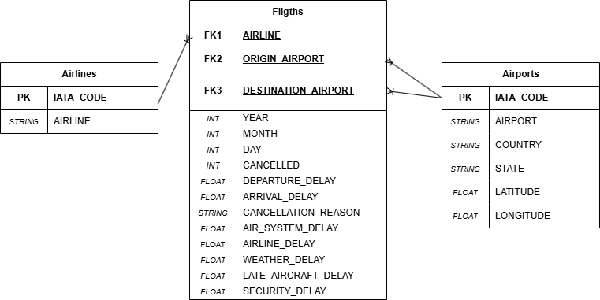

# Flights Data Engineering

Pipeline de datos end-to-end sobre el dataset de vuelos domésticos de EE.UU. 2015 (5.8M vuelos).

> Un análisis contesta una pregunta. Un pipeline de datos la contesta todos los días, de forma confiable, sin que nadie tenga que intervenir. En esta tarea construyes ese pipeline: desde los CSVs crudos hasta el análisis estadístico, pasando por una arquitectura Medallion en S3 y Athena, un modelo relacional en PostgreSQL, y un notebook de análisis con regresión y pronóstico de series de tiempo. El dataset es el registro completo de vuelos domésticos en Estados Unidos durante 2015 — 5.8 millones de vuelos, tres tablas, decisiones reales de diseño.

## Objetivo

Al terminar esta tarea habrás construido, de principio a fin, un pipeline de datos sobre el dataset de vuelos de 2015:

- **ETL scripts** (no notebooks) que implementan la arquitectura Medallion Bronze → Silver → Gold sobre S3 y Athena con AWS Glue Data Catalog
- **Modelo relacional** en PostgreSQL provisionado con CloudFormation, cargado con SQLAlchemy y consultado con DBeaver
- **Análisis exploratorio** en Jupyter con visualizaciones sobre las agregaciones Silver y Gold
- **Regresión estadística** con `statsmodels` para identificar los factores que explican el retraso de llegada
- **Pronóstico de series de tiempo** con `StatsForecast` (AutoETS, AutoARIMA, AutoTheta) sobre la demanda mensual de vuelos

---

## Arquitectura

```
CSVs locales  →  Bronze (S3 + Glue)  →  Silver (Parquet + Snappy)  →  Gold (Anthena CTAS) 
↓
PostgresSQL (RDS)
↓
Notebook de análisis
```

---

## ETL — Arquitectura Medallion

| Capa   | Script          | Descripción |
|--------|-----------------|-------------|
| Bronze | `etl/bronze.py` | Sube los tres CSVs a S3 y los registra en Glue |
| Silver | `etl/silver.py` | Transforma a Parquet + Snappy y construye tres agregaciones |
| Gold   | `etl/gold.py`   | Ejecuta el CTAS en Athena para construir la tabla analítica |

---

## Cómo correr el ETL

```bash
python etl/bronze.py --bucket itam-analytics-ana --data-dir data/flights
python etl/silver.py --bucket itam-analytics-ana
python etl/gold.py   --bucket itam-analytics-ana
```
---

## ERD



---

## Análisis

El notebook `flights_analytics.ipynb` contiene:
- Queries SQL sobre PostgreSQL (P1-P5, W1-W3)
- Regresión lineal con `statsmodels`
- Pronóstico de series de tiempo con `StatsForecast`

---

## Screenshots 


